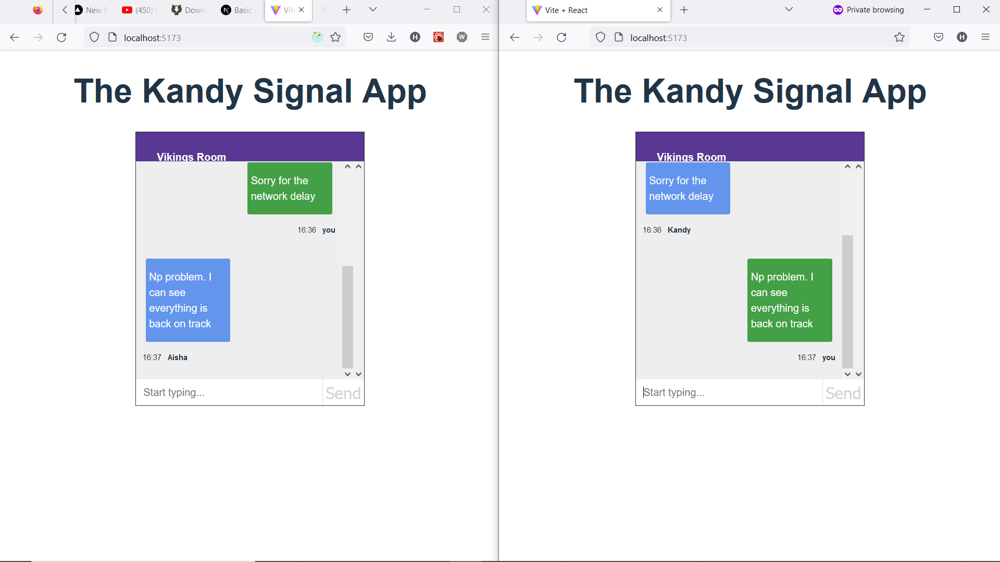

# Real-Time Chat Application in React Using Socket.io and Redux
### This is a chat application to test my UI and skills of working with web sockets.
The technologies used include:
- Redux
- Redux Persist
- React Hooks
- Socke.io
- Cors
- Express
- Nodemon
- React-scroll-to-bottom
- socket.io-client
- @reduxjs/toolkit

# How to run the app

First of all clone the repo: `git clone https://github.com/Kandy-Hamisi/chat-socket.git`

A folder `chat-socket` will be created with two folders: `backend` and `frontend`

Enter the frontend and backend folders via terminal using: `cd frontend` and `cd backend` then run `npm install` to install the required packages.

In the frontend folder run `npm run dev` to start the development server on your localhost machine. default is localhost:5173

In the backend folder run `npm start` to start the backend server for listening to the port. Default is localhost:5000

Now open two different browser windows, login to the room and enjoy a seemless conversation with your peers or yourself
